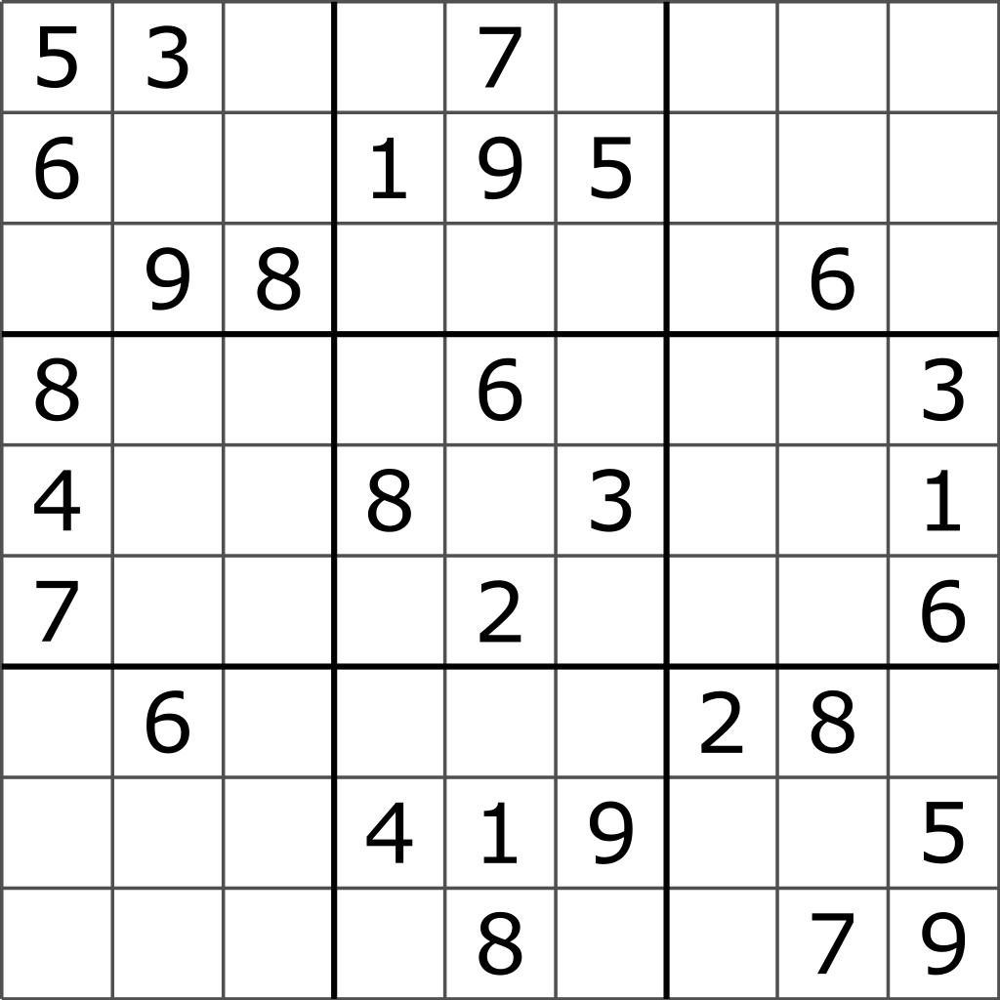

# Sudoku Solver



This GitHub repository contains two Python files that offer solutions for solving Sudoku puzzles. One file allows you to solve the Sudoku puzzle in the terminal, while the other provides a graphical user interface (GUI) for a more user-friendly experience.

## Files

1. `sudoku_solver.py`: This file contains the Python code for solving Sudoku puzzles in the terminal. It uses a backtracking algorithm to find the solution and prints it out on the screen. The user can input the unsolved Sudoku puzzle as a 9x9 grid, where empty cells are represented as zeros (0).

2. `sudoku_gui.py`: This file contains the Python code for the GUI-based Sudoku solver. It provides an interactive interface that allows the user to input the unsolved Sudoku puzzle using mouse clicks and then click a "Solve" button to obtain the solution. The GUI is designed to be intuitive and visually appealing, making it easier for users to interact with the solver.

## Usage

### Terminal Sudoku Solver

1. Make sure you have Python 3.x installed on your system.

2. Open a terminal window and navigate to the directory containing `sudoku_solver.py`.

3. Run the following command to execute the terminal Sudoku solver:

   ```bash
   python sudoku_solver.py
   ```
   
4. Enter the unsolved Sudoku puzzle as a 9x9 grid in the terminal. Use zeros (0) to represent empty cells.

5. The solver will find the solution and display it on the screen.

### GUI Sudoku Solver
1. Ensure you have Python 3.x and the necessary GUI libraries installed. You can install required libraries using pip:

    ```bash
    pip install tkinter
    ```
2. Open a terminal window and navigate to the directory containing sudoku_gui.py.

3. Run the following command to start the GUI Sudoku solver:

    ```bash
    python sudoku_gui.py
    ```

4. A graphical window will pop up with the predefined Sudoku grid.

5. Click the "Solve" button to solve the Sudoku puzzle.

6. The GUI solver will find the solution and display it in the Sudoku grid.

### Contributing
Contributions to this project are welcome. If you find any issues or want to add new features, feel free to open a pull request.

### License
This project is licensed under the MIT License.

We hope you find these Sudoku solvers useful and have fun playing with them! If you have any questions or encounter any problems, please don't hesitate to reach out by opening an issue in this repository. Happy Sudoku solving!
